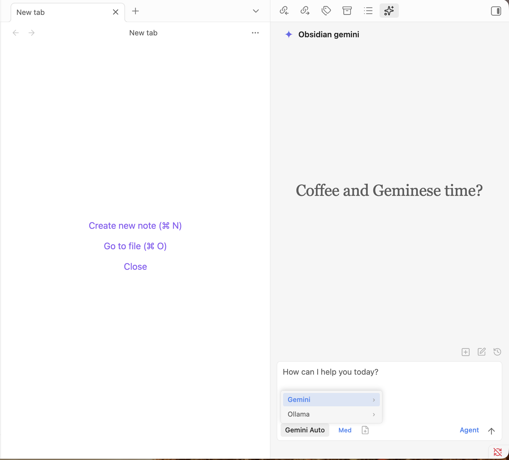
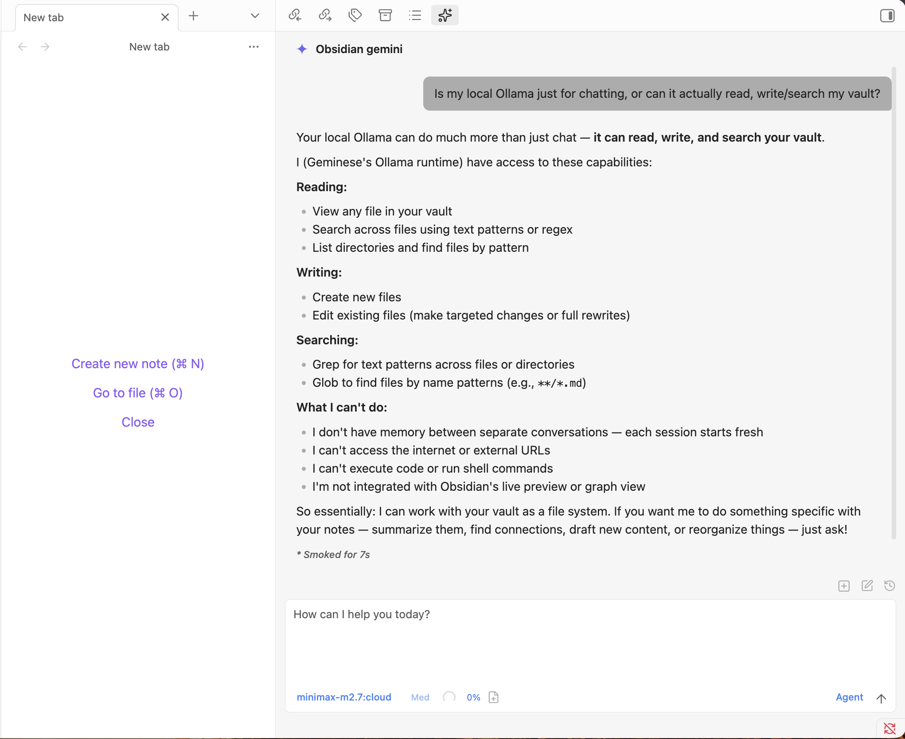
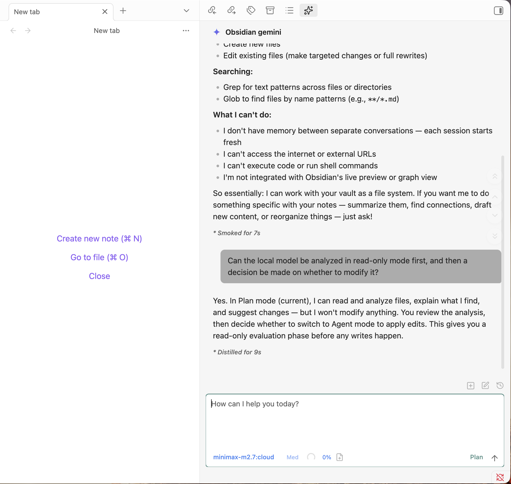

# geminese

<p align="center"><a href="README.md">English</a> | <a href="README.zh-CN.md">Chinese (Simplified)</a> | <a href="README.zh-TW.md">Chinese (Traditional)</a></p>



geminese 把 Gemini 和 Ollama 一起带进 Obsidian。你可以继续使用 Gemini 的原生云端能力，也可以切换到本地 Ollama，在自己的 vault 中完成规划、搜索、编辑与 agent 工作流。

本地模型在这里的意义，不只是“换一个聊天模型”。在 geminese 里，Ollama 可以直接作为 vault 内的 agent 工作：查看文件、搜索笔记、整理内容、起草修改，并且在真正写入之前先完成规划。



Gemini 仍然保留完整的原生路线，适合希望继续使用 Gemini CLI、云端模型和 Gemini 专属能力的用户。

## 功能特性

- **双模型路线**：可在聊天工具栏中直接切换 Gemini 云端模型和本地运行的 Ollama 模型。
- **完整代理能力**：把你的 vault 当作真正的工作空间，直接在 Obsidian 中读取、写入、编辑和搜索文件。
- **本地优先工作流**：通过本地 Ollama HTTP 运行时完成更私有、更贴近 vault 的规划与 agent 工作。
- **Gemini 无需 API Key**：使用 Gemini CLI 并通过 Google 账号认证，可直接使用免费额度（60 次请求/分钟，1000 次请求/天）。
- **上下文感知**：自动附加当前聚焦笔记；使用 `@` 提及文件；按标签排除笔记；包含编辑器选中内容；并可接入 vault 外目录作为额外上下文。
- **视觉支持**：支持通过拖拽、粘贴或文件路径发送图片进行分析。
- **行内编辑**：可直接在笔记中编辑选中文本，或在光标处插入内容，并提供词级 diff 预览。
- **指令模式（`#`）**：使用 Gemini 时，可在聊天输入框中直接添加精炼后的自定义指令到系统提示词。
- **斜杠命令**：通过 `/command` 触发可复用的提示词模板，支持参数占位符和 `@file` 引用。
- **MCP 支持**：使用 Gemini 原生工作流时，可通过 Model Context Protocol 连接外部工具和数据源（stdio、SSE、HTTP）。
- **模型选择**：可在 Gemini Auto、Pro、Flash、Flash Lite 与本地已安装的 Ollama 模型之间切换。
- **计划模式**：通过 Shift+Tab 切换计划模式，Gemini 或 Ollama 都可以先探索和设计，再决定是否执行实现。
- **安全机制**：权限模式包括 **Agent**（可执行工具与编辑文件）和 **Plan**（只读规划），并提供命令黑名单与 vault 范围访问控制。
- **10 种语言**：英文、中文（简体/繁体）、日语、韩语、西班牙语、德语、法语、葡萄牙语、俄语。

Plan 模式让本地工作流更可控：先阅读和分析，再做决定，只有切换到 Agent 模式后才真正修改内容。



## 环境要求

- Obsidian v1.4.5+
- 仅支持桌面端（macOS、Linux、Windows）
- 使用 Gemini 模型时：需安装 [Gemini CLI](https://github.com/google-gemini/gemini-cli) 并使用 Google 账号登录（免费版可用）
- 使用 Ollama 模型时：需在本地运行 Ollama，并至少安装一个可用模型

## 安装

### 前置步骤

#### 方案 1：使用 Gemini

**macOS 与 Linux**
```bash
npm install -g @google/gemini-cli
```

**Windows**
1. 从 [nodejs.org](https://nodejs.org/) 安装 Node.js，并确保安装时勾选了 “Add to PATH”。
2. 打开 Command Prompt 或 PowerShell，安装 CLI：
   ```powershell
   npm install -g @google/gemini-cli
   ```
3. **重要：** 安装后请完整重启 Obsidian，以确保它能读取新的环境变量。

然后在Terminal中执行认证：

```bash
gemini
```

按提示使用 Google 账号登录。

#### 方案 2：使用本地 Ollama

请先在你的设备上安装并启动 Ollama，确保本地 HTTP API 可访问，并至少安装一个模型。如有需要，可稍后在设置中的 **Ollama base URL** 修改连接地址。

### 安装插件

1. 从 [latest release](https://github.com/Momoyu404/geminese/releases/latest) 下载 `main.js`、`manifest.json`、`styles.css`
2. 在你的 vault 插件目录创建 `geminese` 文件夹：
   ```
   /path/to/vault/.obsidian/plugins/geminese/
   ```
3. 将下载的三个文件复制到该目录
4. 在 Obsidian 设置 → 社区插件 中刷新启用插件

## Skills

通过 [Obsidian Skills](https://github.com/kepano/obsidian-skills) 增强 geminese 的能力。这些技能会教 Gemini 与本地 vault 工作流如何处理 Obsidian Markdown、Bases、JSON Canvas、CLI 等任务。

### 安装 Skills

只需在 Terminal 中打开 gemini，然后输入：

```
Help me install the Obsidian Skills plugin from https://github.com/kepano/obsidian-skills
```

Gemini 会自动克隆仓库并为你完成配置。

<sub>*如果 AI 可以做，为什么还要人类自己折腾？把这种事交给 AI 吧。*</sub>

### 可用 Skills

| Skill | 描述 |
|-------|------|
| [obsidian-markdown](https://github.com/kepano/obsidian-skills/tree/main/skills/obsidian-markdown) | Obsidian 风格 Markdown：wikilinks、嵌入、callout、properties |
| [obsidian-bases](https://github.com/kepano/obsidian-skills/tree/main/skills/obsidian-bases) | Obsidian Bases：视图、过滤器、公式、汇总 |
| [json-canvas](https://github.com/kepano/obsidian-skills/tree/main/skills/json-canvas) | JSON Canvas：节点、边、分组、连接 |
| [obsidian-cli](https://github.com/kepano/obsidian-skills/tree/main/skills/obsidian-cli) | Obsidian CLI：管理 vault、开发插件/主题 |
| [defuddle](https://github.com/kepano/obsidian-skills/tree/main/skills/defuddle) | 从网页提取干净的 Markdown，去除干扰内容以节省 token |

## 使用方式

**两种模式：**
1. 点击左侧边栏机器人图标，或通过命令面板打开聊天
2. 选中文本 + 快捷键进行行内编辑

你可以使用 Gemini 或 Ollama 在 vault 中读写、编辑、搜索文件。

**检查是否连接成功：** 如果聊天中能收到回复，说明已连接。你可以询问例如 “What model are you?” 进行确认。输入工具栏中的 **模型** 选择器会显示 Gemini 选项和本地可用的 Ollama 模型，点击即可切换。权限模式（**Plan / Agent**）：Plan 只读规划，Agent 可执行工具并编辑文件。

### 上下文

- **文件**：自动附加当前聚焦笔记；输入 `@` 可附加其他文件
- **选区**：在编辑器中选中文本后发起聊天，选区会自动作为上下文
- **图片**：支持拖拽、粘贴或输入路径
- **外部上下文**：点击工具栏文件夹图标，可访问 vault 外目录

### 功能

- **行内编辑**：选中文本 + 快捷键，直接在笔记里编辑
- **指令模式**：输入 `#`，向系统提示词添加精炼指令
- **斜杠命令**：输入 `/` 使用自定义提示词模板
- **MCP**：在 设置 → MCP Servers 添加外部工具；聊天中使用 `@mcp-server` 激活

## 配置

### 设置项

**自定义**
- **User name**：用于个性化问候
- **Excluded tags**：带这些标签的笔记不会自动加载
- **Media folder**：配置 vault 的附件目录，以支持嵌入图片
- **Custom system prompt**：附加到默认系统提示词后的额外指令

**安全**
- **Enable command blocklist**：启用危险命令黑名单（默认开启）
- **Blocked commands**：要拦截的命令模式（支持正则，平台相关）
- **Allowed export paths**：允许导出到 vault 外部的路径

**环境**
- **Custom variables**：环境变量（KEY=VALUE 格式）
- **Environment snippets**：保存/恢复环境变量配置

**高级**
- **Gemini CLI path**：自定义 Gemini CLI 路径（留空则自动检测）

## 安全与权限

| 范围 | 权限 |
|------|------|
| **Vault** | 完整读写（通过 `realpath` 防止符号链接越界） |
| **Export paths** | 仅写入（例如 `~/Desktop`、`~/Downloads`） |
| **External contexts** | 完整读写（仅当前会话） |

- **Agent 模式**：默认模式，可执行工具并编辑文件（含安全拦截与审批）
- **Plan 模式**：只读模式，先探索和设计再实施

## 隐私与数据使用

- **发送到 API 的数据**：你的输入、附加文件、图片和工具调用输出会通过 CLI 发送至 Google Gemini API。
- **本地存储**：设置与会话元数据存储在 `vault/.gemini/`；会话数据由 Gemini CLI 管理。
- **无额外遥测**：除 Google Gemini API 外不做追踪。

## 故障排查

### 找不到 Gemini CLI

如果出现 `Gemini CLI not found`，说明插件无法自动检测到你的安装路径。

**解决方案**：找到 CLI 路径，并在 设置 → 高级 → Gemini CLI path 中配置。

| 平台 | 命令 | 示例路径 |
|------|------|----------|
| macOS/Linux | `which gemini` | `/usr/local/bin/gemini` |
| macOS (Homebrew) | `which gemini` | `/opt/homebrew/bin/gemini` |
| Windows | `where.exe gemini` | `%APPDATA%\npm\node_modules\@google\gemini-cli\dist\index.js` |
| npm 全局安装 | `npm root -g` | `{root}/@google/gemini-cli/dist/index.js` |

**替代方案**：在 设置 → Environment → Custom variables 中，将 Node.js 的 bin 目录加入 PATH。

### 认证问题

请先确保你已经完成 Gemini CLI 登录认证：

```bash
gemini
```

命令会打开浏览器进行 Google 账号登录。登录完成后，CLI（以及插件）即可使用你的账号。

### 开发

```bash
npm run dev     # 监听模式
npm run build   # 生产构建
npm run test    # 运行测试
npm run lint    # 代码检查
```

## 架构

```
Obsidian Plugin (UI)
      ↓
child_process.spawn("gemini", ["--output-format", "stream-json", ...])
      ↓
Gemini CLI → Google Account (no API key)
```

插件会为每次查询启动 Gemini CLI 子进程，并传入 `--output-format stream-json` 以获取结构化 JSONL 输出。会话连续性通过 `--resume` 维护。

更多源码结构与开发说明见 [ARCHITECTURE.md](ARCHITECTURE.md)。

## 许可证

项目基于 [MIT License](LICENSE) 发布。
