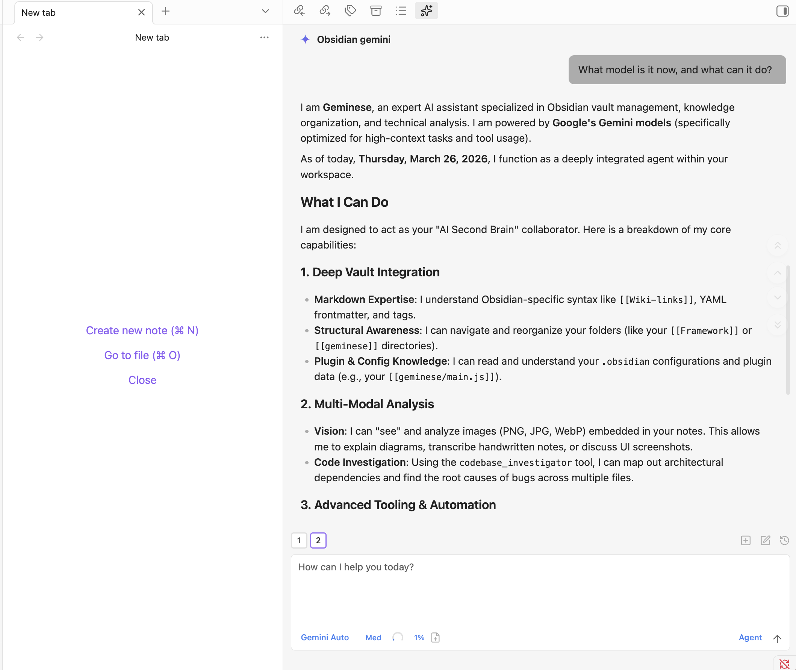

# geminese

<p align="center"><a href="README.md">English</a> | <a href="README.zh-CN.md">Chinese (Simplified)</a> | <a href="README.zh-TW.md">Chinese (Traditional)</a></p>


geminese 把 Gemini 和 Ollama 一起帶進 Obsidian。你可以繼續使用 Gemini 的原生雲端能力，也可以切換到本地 Ollama，在自己的 vault 中完成規劃、搜尋、編輯與 agent 工作流。

本地模型在這裡的意義，不只是「換一個聊天模型」。在 geminese 裡，Ollama 可以直接作為 vault 內的 agent 工作：查看檔案、搜尋筆記、整理內容、起草修改，並且在真正寫入之前先完成規劃。


Gemini 仍然保留完整的原生路線，適合希望繼續使用 Gemini CLI、雲端模型和 Gemini 專屬能力的使用者。



## 功能特色

- **雙模型路線**：可在聊天工具列中直接切換 Gemini 雲端模型和本地運行的 Ollama 模型。
- **完整代理能力**：把你的 vault 當作真正的工作空間，直接在 Obsidian 中讀取、寫入、編輯和搜尋檔案。
- **本地優先工作流**：透過本地 Ollama HTTP 執行環境完成更私有、更貼近 vault 的規劃與 agent 工作。
- **Gemini 無需 API Key**：使用 Gemini CLI 並透過 Google 帳號驗證，可直接使用免費額度（60 次請求/分鐘，1000 次請求/天）。
- **上下文感知**：自動附加目前聚焦筆記；使用 `@` 提及檔案；依標籤排除筆記；包含編輯器選取內容；並可接入 vault 外目錄作為額外上下文。
- **視覺支援**：支援透過拖放、貼上或檔案路徑傳送圖片進行分析。
- **行內編輯**：可直接在筆記中編輯選取文字，或在游標處插入內容，並提供詞級 diff 預覽。
- **指令模式（`#`）**：使用 Gemini 時，可在聊天輸入框中直接加入精煉後的自訂指令到系統提示詞。
- **斜線命令**：透過 `/command` 觸發可重複使用的提示詞模板，支援參數占位符與 `@file` 引用。
- **MCP 支援**：使用 Gemini 原生工作流時，可透過 Model Context Protocol 連接外部工具與資料來源（stdio、SSE、HTTP）。
- **模型選擇**：可在 Gemini Auto、Pro、Flash、Flash Lite 與本地已安裝的 Ollama 模型之間切換。
- **計畫模式**：透過 Shift+Tab 切換計畫模式，Gemini 或 Ollama 都可以先探索和設計，再決定是否執行實作。
- **安全機制**：權限模式包含 **Agent**（可執行工具與編輯檔案）和 **Plan**（唯讀規劃），並提供命令黑名單與 vault 範圍存取控制。
- **10 種語言**：英文、中文（簡體/繁體）、日文、韓文、西班牙文、德文、法文、葡萄牙文、俄文。

Plan 模式讓本地工作流更可控：先閱讀和分析，再做決定，只有切換到 Agent 模式後才真正修改內容。


## 環境需求

- Obsidian v1.4.5+
- 僅支援桌面端（macOS、Linux、Windows）
- 使用 Gemini 模型時：需安裝 [Gemini CLI](https://github.com/google-gemini/gemini-cli) 並使用 Google 帳號登入（免費版可用）
- 使用 Ollama 模型時：需在本地執行 Ollama，並至少安裝一個可用模型

## 安裝

### 前置步驟

#### 方案 1：使用 Gemini

**macOS 與 Linux**
```bash
npm install -g @google/gemini-cli
```

**Windows**
1. 從 [nodejs.org](https://nodejs.org/) 安裝 Node.js，並確認安裝時勾選了「Add to PATH」。
2. 開啟 Command Prompt 或 PowerShell，安裝 CLI：
   ```powershell
   npm install -g @google/gemini-cli
   ```
3. **重要：** 安裝後請完整重新啟動 Obsidian，以確保它能讀取新的環境變數。

接著在Terminal中執行驗證：

```bash
gemini
```

依提示使用 Google 帳號登入。

#### 方案 2：使用本地 Ollama

請先在你的裝置上安裝並啟動 Ollama，確保本地 HTTP API 可存取，並至少安裝一個模型。如有需要，可稍後在設定中的 **Ollama base URL** 修改連線位址。

### 安裝外掛

1. 從 [latest release](https://github.com/Momoyu404/geminese/releases/latest) 下載 `main.js`、`manifest.json`、`styles.css`
2. 在你的 vault 外掛目錄建立 `geminese` 資料夾：
   ```
   /path/to/vault/.obsidian/plugins/geminese/
   ```
3. 將下載的三個檔案複製到該目錄
4. 在 Obsidian 設定 → 社群外掛 中重新整理並啟用外掛

## Skills

透過 [Obsidian Skills](https://github.com/kepano/obsidian-skills) 增強 geminese 的能力。這些技能會教 Gemini 與本地 vault 工作流如何處理 Obsidian Markdown、Bases、JSON Canvas、CLI 等任務。

### 安裝 Skills

只需在 Terminal 中開啟 gemini，然後輸入：

```
Help me install the Obsidian Skills plugin from https://github.com/kepano/obsidian-skills
```

Gemini 會自動 clone 倉庫並為你完成設定。

<sub>*如果 AI 可以做，為什麼還要人類自己折騰？把這種事交給 AI 吧。*</sub>

### 可用 Skills

| Skill | 描述 |
|-------|------|
| [obsidian-markdown](https://github.com/kepano/obsidian-skills/tree/main/skills/obsidian-markdown) | Obsidian 風格 Markdown：wikilinks、嵌入、callout、properties |
| [obsidian-bases](https://github.com/kepano/obsidian-skills/tree/main/skills/obsidian-bases) | Obsidian Bases：視圖、篩選器、公式、彙總 |
| [json-canvas](https://github.com/kepano/obsidian-skills/tree/main/skills/json-canvas) | JSON Canvas：節點、邊、分組、連線 |
| [obsidian-cli](https://github.com/kepano/obsidian-skills/tree/main/skills/obsidian-cli) | Obsidian CLI：管理 vault、開發外掛/主題 |
| [defuddle](https://github.com/kepano/obsidian-skills/tree/main/skills/defuddle) | 從網頁提取乾淨的 Markdown，移除干擾內容以節省 token |

## 使用方式

**兩種模式：**
1. 點擊左側邊欄機器人圖示，或透過命令面板開啟聊天
2. 選取文字 + 快捷鍵進行行內編輯

你可以使用 Gemini 或 Ollama 在 vault 中讀寫、編輯、搜尋檔案。

**檢查是否連線成功：** 如果聊天中能收到回覆，代表已連線。你可以詢問例如「What model are you?」進行確認。輸入工具列中的 **模型** 選擇器會顯示 Gemini 選項和本地可用的 Ollama 模型，點擊即可切換。權限模式（**Plan / Agent**）：Plan 唯讀規劃，Agent 可執行工具並編輯檔案。

### 上下文

- **檔案**：自動附加目前聚焦筆記；輸入 `@` 可附加其他檔案
- **選取內容**：在編輯器中選取文字後發起聊天，選取內容會自動作為上下文
- **圖片**：支援拖放、貼上或輸入路徑
- **外部上下文**：點擊工具列資料夾圖示，可存取 vault 外目錄

### 功能

- **行內編輯**：選取文字 + 快捷鍵，直接在筆記中編輯
- **指令模式**：輸入 `#`，向系統提示詞加入精煉指令
- **斜線命令**：輸入 `/` 使用自訂提示詞模板
- **MCP**：在 設定 → MCP Servers 新增外部工具；聊天中使用 `@mcp-server` 啟用

## 設定

### 設定項目

**自訂**
- **User name**：用於個人化問候
- **Excluded tags**：帶有這些標籤的筆記不會自動載入
- **Media folder**：設定 vault 的附件目錄，以支援嵌入圖片
- **Custom system prompt**：附加到預設系統提示詞後的額外指令

**安全**
- **Enable command blocklist**：啟用危險指令黑名單（預設開啟）
- **Blocked commands**：要攔截的命令模式（支援正則，平台相關）
- **Allowed export paths**：允許匯出到 vault 外部的路徑

**環境**
- **Custom variables**：環境變數（KEY=VALUE 格式）
- **Environment snippets**：儲存/還原環境變數設定

**進階**
- **Gemini CLI path**：自訂 Gemini CLI 路徑（留空則自動偵測）

## 安全與權限

| 範圍 | 權限 |
|------|------|
| **Vault** | 完整讀寫（透過 `realpath` 防止符號連結越界） |
| **Export paths** | 僅寫入（例如 `~/Desktop`、`~/Downloads`） |
| **External contexts** | 完整讀寫（僅目前會話） |

- **Agent 模式**：預設模式，可執行工具並編輯檔案（含安全攔截與審批）
- **Plan 模式**：唯讀模式，先探索與設計再實作

## 隱私與資料使用

- **傳送到 API 的資料**：你的輸入、附加檔案、圖片和工具呼叫輸出會透過 CLI 傳送至 Google Gemini API。
- **本機儲存**：設定與會話中繼資料儲存在 `vault/.gemini/`；會話資料由 Gemini CLI 管理。
- **無額外遙測**：除 Google Gemini API 外不做追蹤。

## 故障排除

### 找不到 Gemini CLI

如果出現 `Gemini CLI not found`，代表外掛無法自動偵測到你的安裝路徑。

**解決方案**：找到 CLI 路徑，並在 設定 → 進階 → Gemini CLI path 中設定。

| 平台 | 命令 | 範例路徑 |
|------|------|----------|
| macOS/Linux | `which gemini` | `/usr/local/bin/gemini` |
| macOS (Homebrew) | `which gemini` | `/opt/homebrew/bin/gemini` |
| Windows | `where.exe gemini` | `%APPDATA%\npm\node_modules\@google\gemini-cli\dist\index.js` |
| npm 全域安裝 | `npm root -g` | `{root}/@google/gemini-cli/dist/index.js` |

**替代方案**：在 設定 → Environment → Custom variables 中，將 Node.js 的 bin 目錄加入 PATH。

### 驗證問題

請先確認你已完成 Gemini CLI 登入驗證：

```bash
gemini
```

命令會開啟瀏覽器進行 Google 帳號登入。登入完成後，CLI（以及外掛）即可使用你的帳號。

### 開發

```bash
npm run dev     # 監看模式
npm run build   # 生產建置
npm run test    # 執行測試
npm run lint    # 程式碼檢查
```

## 架構

```
Obsidian Plugin (UI)
      ↓
child_process.spawn("gemini", ["--output-format", "stream-json", ...])
      ↓
Gemini CLI → Google Account (no API key)
```

外掛會為每次查詢啟動 Gemini CLI 子程序，並傳入 `--output-format stream-json` 以取得結構化 JSONL 輸出。會話連續性透過 `--resume` 維持。

更多原始碼結構與開發說明見 [ARCHITECTURE.md](ARCHITECTURE.md)。

## 授權

專案基於 [MIT License](LICENSE) 發布。
